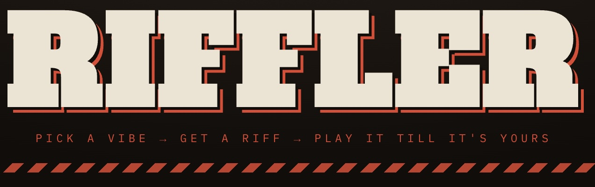

<p align="center">
  
</p>

Vibe-to-riff practice engine. Pick a vibe (garage stomp, heavy groove,
microtonal psych, desert fuzz, doom ritual), get a generated 4-bar chord
progression + riff as guitar tab with a suggested tempo, then play along with
a moving cursor, synthesized guitar + drums, count-in, and looping.

## Run it

```sh
npm install
npm run dev      # → http://localhost:5173
```

## Practice workflow

1. Pick a vibe, hit **NEW RIFF** until you find one you like (riffs are
   seeded — the URL hash is shareable / reload-safe).
2. Drag the tempo down, turn **CLICK** on, and learn the shape.
3. Turn **GUITAR** off to play the riff yourself over just drums.
4. Work the tempo back up to the suggested BPM.

Keyboard: `SPACE` play/stop · `N` new riff · `↑/↓` tempo.

## How it works

- **Generation** (`src/music/`) — rule-based, no AI: each vibe defines keys,
  a scale, progression templates (semitone offsets), 16-step rhythm patterns,
  drum grooves, and amp settings. A seeded RNG picks and mutates; a lick
  walker random-walks the scale near the chord root so everything stays in
  one playable position.
- **Audio** (`src/audio/`) — Web Audio API. Guitar is Karplus-Strong plucked
  string synthesis rendered into cached buffers (exact frequencies, so the
  quarter-tone "+" notes in Microtonal Psych are real quarter-tones), fed
  through a tanh waveshaper amp. Drums are classic analog recipes. A
  lookahead scheduler keeps timing sample-accurate.
- **Tab** (`src/tab.ts`) — custom SVG renderer: 6-line tab, chord names,
  palm-mute spans, slide/accent/microtone markers, repeat barlines, and a
  playhead the UI interpolates every frame.

## Tab legend

`PM` palm mute · `+` quarter-sharp (light bend) · `/` slide in ·
bold = accent · 𝄆 𝄇 = the 4 bars loop.
